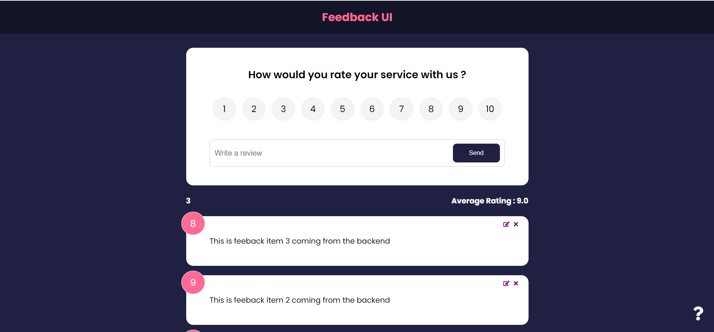

# Feedback UI

A user-friendly React application designed to provide an accessible platform for leaving valuable feedback about products and services.

## Table of Contents

- [Overview](#overview)
  - [About Feedback UI](#about-feedback-ui)
  - [Screenshot](#screenshot)
  - [Links](#links)
- [Technologies Used](#technologies-used)
- [Getting Started](#getting-started)
- [Contributing](#contributing)
- [License](#license)
- [Author](#author)

## Overview

### About Feedback UI

"Feedback UI" is a React application designed to streamline the process of providing feedback for products and services. It offers an accessible and user-friendly interface, efficient state management, and interactive icons for an enhanced feedback experience.

### Screenshot

### Links

- Repository: [GitHub Repo](#) (Add your GitHub repository URL here)

## Technologies Used

- React.js
- Context API
- React Icons
- React Router DOM
- json-server

## What I Learned

During the development of "Feedback UI," I gained valuable insights and learned several key concepts and skills:

- **React.js Proficiency**: This project provided an opportunity to strengthen my proficiency in React.js, mastering the core concepts of component-based development and state management.

- **Context API**: I learned how to effectively utilize React's Context API for efficient state management, enabling seamless data sharing and synchronization across components.

- **Icon Integration**: Integrating React Icons enhanced the visual appeal and interactivity of the user interface, adding a dynamic touch to the feedback experience.

- **Routing with React Router DOM**: I explored and implemented smooth navigation and routing within the application using React Router DOM, creating a seamless user journey.

- **Mock REST API with json-server**: The use of json-server to simulate a REST API for data posting, updating, and deleting was a valuable learning experience, allowing me to interact with data in a controlled environment.

- **CSS Styling and Responsiveness**: I honed my skills in CSS styling and responsiveness, ensuring a visually appealing and user-friendly design across various devices.

These learnings have enriched my development skills and will undoubtedly contribute to the success of future projects.

## Getting Started

To run the project locally, follow these steps:

1. Clone this repository.
2. Install the required dependencies with `npm install`.
3. Start the development server with `npm run dev`.
4. Visit `http://localhost:3000` in your web browser to explore and use "Feedback UI."

## Contributing

Contributions are welcome! Feel free to fork the repository and create a pull request.

## License

This project is open-source and available under the [MIT License](LICENSE).

## Author

- GitHub: [Saurabh13042004](https://github.com/Saurabh13042004)
- LinkedIn: [saurabh-shukla](https://www.linkedin.com/in/saurabh-shukla-0b45b3224/)
- Email: [saurabh1258.be21@chitkarauniversity.edu.in](mailto:saurabh1258.be21@chitkarauniversity.edu.in)
